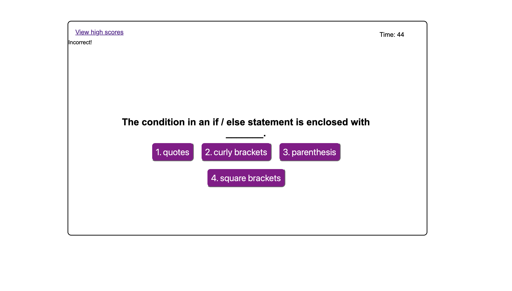

## Description

Creating a timed code quiz using Javascript, HTML, and CSS. Timed quiz including different techniques such as using localstorage and event listeners.

## Screenshot

## Deployed Application
Link: https://fruitxxsnackz.github.io/js-timed-quiz/ 